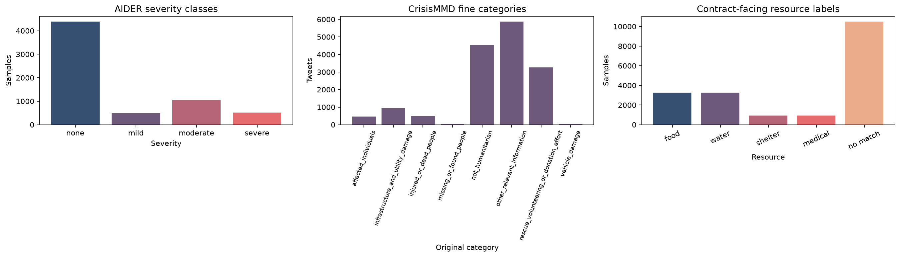
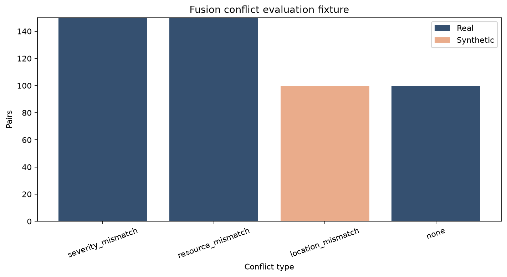
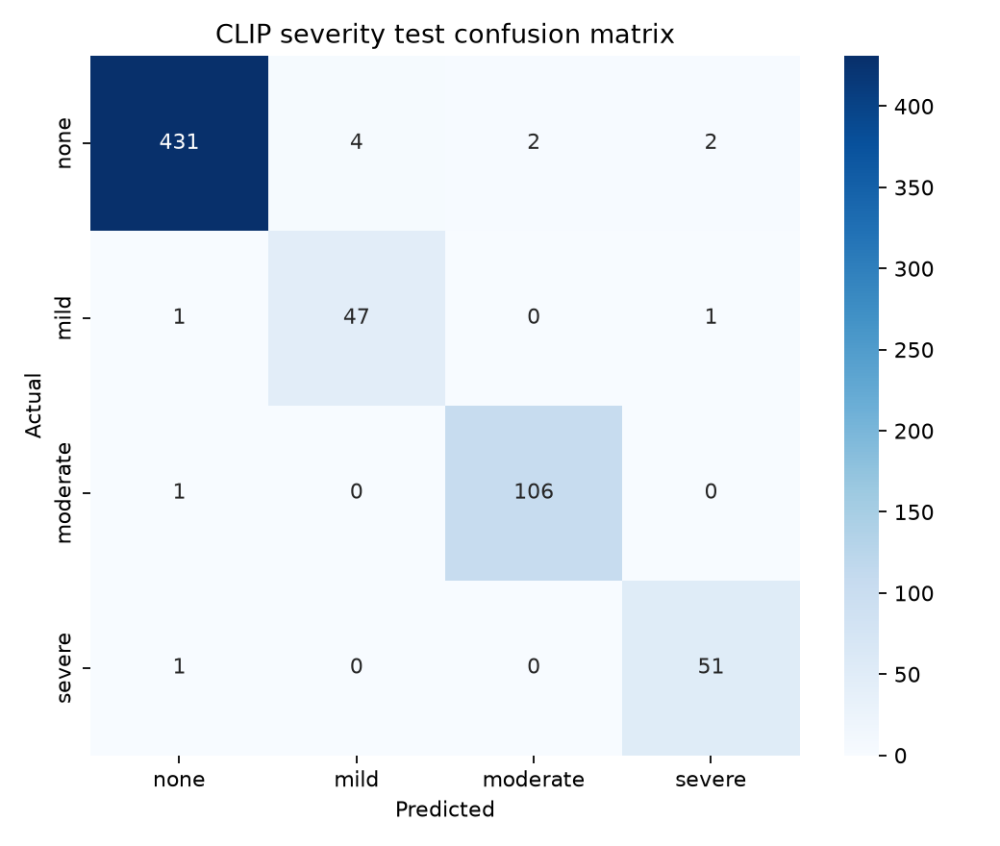

# Vision and NLP Contribution

## Dataset and Inputs

### AIDER

The vision module used the Aerial Image Dataset for Emergency Response Applications
(AIDER), which contains normal aerial scenes and images of fires, floods, collapsed
buildings, and traffic accidents [1]. The processed sample contained 6,433 images.
Direct counting produced 4,390 examples assigned to the `none` severity class, 485
assigned to `mild`, 1,047 assigned to `moderate`, and 511 assigned to `severe`.

AIDER provides event categories rather than the four-level severity target required
by DisasterLens. The labels were therefore remapped using an application-specific
rule. Normal scenes became `none`, and minor traffic incidents became `mild`.
Fire and partial flooding were assigned `moderate`, while collapsed buildings and
severe flooding were assigned `severe`. This transformation enabled the vision
module to return severity directly during inference.

### CrisisMMD

The language module used CrisisMMD, a multimodal collection of tweets and images
from seven natural disasters [2]. Loading the downloaded humanitarian annotations
identified 18,082 image-text pairs and 16,058 unique tweets. The annotations contain
eight humanitarian categories: affected individuals, infrastructure and utility
damage, injured or dead people, missing or found people, not humanitarian, other
relevant information, rescue or donation effort, and vehicle damage.

After conflict-evaluation identifiers were excluded, 15,637 text records remained
for model development. Other relevant information was the largest category with
5,872 records. Missing or found people had only 40 records, and vehicle damage had
54. This imbalance motivated the use of class weighting and macro-averaged
evaluation.

The eight fine categories were retained for model training because they preserve
distinctions relevant to urgency analysis. A separate mapping converts the predicted
category into the four-resource application vocabulary. Infrastructure damage maps
to shelter. Affected individuals and injured people map to medical. Rescue or
donation effort maps to food and water. Categories without a direct resource
interpretation return an empty resource list.

### Image-Text Conflict Fixture

The original CrisisMMD text and image humanitarian labels differ in 10,003 pairs.
This count identifies potential disagreement, not confirmed severity conflict. A
separate 500-row fixture was created to test fusion behavior under controlled
conditions. It contains 150 real severity mismatches, 150 real resource mismatches,
100 real agreement controls, and 100 synthetic location mismatches.

The synthetic location rows combine real images and text associated with different
events. They are marked as synthetic and are not used to estimate real-world
conflict prevalence. In total, 421 unique tweet identifiers represented in the
fixture were removed before the CrisisMMD development splits were created. This
exclusion prevents leakage between the language model and the fusion evaluation.

## Data Analysis

Figure 1 shows the class distribution after preprocessing. AIDER is dominated by
the `none` class, while CrisisMMD is concentrated in other relevant information,
not-humanitarian content, and rescue or donation effort. Accuracy alone would give
the common categories disproportionate influence. Macro-F1 was therefore included
so that each class contributes equally to the reported average.

The original image files varied in size. CLIP preprocessing standardized the input
dimensions expected by the pretrained encoder, so manually engineered
size-dependent features were unnecessary. Tweet lengths were also examined. A
maximum sequence length of 128 tokens retained the relevant short-form content while
limiting memory use.

Figure 2 presents the conflict-fixture composition. The distribution is controlled
by design. It provides enough cases to test severity conflict, resource conflict,
and location conflict while retaining agreement controls. The figure should not be
read as a measurement of how frequently each conflict occurs in operational data.

Text severity in the conflict fixture was derived from deterministic rules using
damage terms and affected-population evidence. A separate 60-record review file was
prepared for manual adjudication. This review remains necessary because lexical
rules may miss indirect descriptions or contextual negation.

## Vision Method

The vision module uses the image encoder from
`openai/clip-vit-base-patch32`, a pretrained vision-language model [3]. The encoder
remains frozen and produces a normalized 512-dimensional representation for each
image. A trainable classification head transforms this representation through a
512-to-128 linear layer and a rectified linear activation. Dropout with probability
0.3 is applied before the final four-class projection.

For output logits \(z_1,\ldots,z_4\), the probability of class \(k\) is calculated
with softmax:

\[
p(y=k\mid x)=\frac{\exp(z_k)}{\sum_{j=1}^{4}\exp(z_j)}.
\]

The class with the highest probability becomes the severity prediction. Its
probability is returned as confidence. Freezing the CLIP encoder reduces training
cost and limits the number of parameters fitted on the comparatively small AIDER
sample.

The public function `predict_severity(image_path)` returns severity, confidence, an
empty damage-type field reserved for future extension, and the model identifier.
This interface prevents the downstream application from depending on AIDER's
original event taxonomy.

## NLP Method

The language classifier uses `FacebookAI/roberta-base`, a transformer model
developed through an optimized BERT pretraining procedure [4]. Input text is
tokenized to a maximum length of 128 tokens. The classifier predicts one of the
eight original CrisisMMD humanitarian categories.

The source labels are mutually exclusive. An initial independent binary-loss
formulation did not represent that structure correctly, so the final model uses
single-label weighted cross-entropy:

\[
\mathcal{L}=-\frac{1}{N}\sum_{i=1}^{N}w_{y_i}\log p(y_i\mid x_i).
\]

The weight \(w_{y_i}\) is based on the inverse square root of class frequency and is
capped at 5. This weighting increases the influence of rare categories without
allowing a very small class to dominate optimization.

`classify_resources_fine_scores(text)` exposes all eight category probabilities for
evaluation. `classify_resources_fine(text)` returns the category with the largest
probability, and `classify_resources(text)` maps that category into food, water,
shelter, or medical. The fine-category scores remain outside the public
`analyze_text()` contract.

Entity extraction is deterministic and local. Pattern-based rules identify event
terms, population expressions, urgency words, and locations introduced by common
spatial prepositions. Missing evidence produces a null or empty value. The rules
provide reproducible behavior, although they cannot cover unrestricted linguistic
variation.

## Experimental Setup

Both datasets used deterministic stratified 80/10/10 splits with seed 42. AIDER was
divided into 5,144 training images, 642 validation images, and 647 test images.
CrisisMMD was divided into 12,506 training records, 1,561 validation records, and
1,570 test records after conflict-fixture exclusion.

The CLIP classification head was trained for 15 epochs. Validation accuracy selected
the final checkpoint, and the held-out test set was evaluated after model selection.
The pretrained image encoder remained frozen throughout training.

RoBERTa was fine-tuned for three epochs with a batch size of 16. Validation macro-F1
was used for checkpoint selection because of the strong category imbalance. The
final evaluation reported both fine-category metrics and four-resource contract
metrics.

Training used plain Python scripts with epoch-level logs. The EDA artifacts were
produced with `disasterlens_modules/notebooks/run_eda.py`. Model configuration,
tokenizer files, training logs, metrics, and confusion matrices were saved for
reproducibility.

## Vision Results

The vision model achieved 98.15 percent accuracy on 647 held-out AIDER images.
Macro precision was 0.9601, macro recall was 0.9781, and macro-F1 was 0.9689.
The best validation accuracy was 98.29 percent.

| Severity | Precision | Recall | F1 | Support |
|---|---:|---:|---:|---:|
| None | 0.9931 | 0.9818 | 0.9874 | 439 |
| Mild | 0.9216 | 0.9592 | 0.9400 | 49 |
| Moderate | 0.9815 | 0.9907 | 0.9860 | 107 |
| Severe | 0.9444 | 0.9808 | 0.9623 | 52 |

The confusion matrix in Figure 3 shows few classification errors. The model
correctly classified 431 of 439 `none` images and 106 of 107 `moderate` images.
The `mild` class had the lowest F1, but its score remained 0.9400.

These results measure performance under the processed AIDER mapping. They do not
establish robustness to unrelated social-media imagery or to a new camera domain.
They also do not measure the fusion layer's response when text contradicts the
image.

## NLP Results

The final RoBERTa checkpoint achieved 52.74 percent accuracy on 1,570 test records.
Weighted F1 was 0.5014, while eight-category macro-F1 was 0.2746. The difference
shows that performance on common categories was substantially stronger than
performance on rare categories.

| Fine category | Precision | Recall | F1 | Support |
|---|---:|---:|---:|---:|
| Affected individuals | 0.1667 | 0.0213 | 0.0377 | 47 |
| Infrastructure and utility damage | 1.0000 | 0.0105 | 0.0208 | 95 |
| Injured or dead people | 0.3889 | 0.5714 | 0.4628 | 49 |
| Missing or found people | 0.0000 | 0.0000 | 0.0000 | 4 |
| Not humanitarian | 0.5989 | 0.4802 | 0.5330 | 454 |
| Other relevant information | 0.5310 | 0.5833 | 0.5559 | 588 |
| Rescue, volunteering, or donation effort | 0.4927 | 0.7248 | 0.5866 | 327 |
| Vehicle damage | 0.0000 | 0.0000 | 0.0000 | 6 |

Rescue or donation effort produced the highest fine-category F1 at 0.5866.
Missing or found people and vehicle damage produced no correct test prediction.
Their supports of four and six are too small for stable conclusions about
generalization.

After category-to-resource mapping, macro-F1 was 0.4020 and micro-F1 was 0.5419.
Food and water each reached an F1 of 0.5866 because they originate from the same
source category. Medical reached 0.4138. Shelter precision was 1.0000, but recall
was only 0.0105, indicating that the model rarely predicted the corresponding
infrastructure category.

The integration sentence, "Heavy flooding in Dhaka. 10,000 people displaced, need
food," exposed a practical limitation. Entity rules recovered the location,
population, event type, and urgency term. RoBERTa predicted other relevant
information, so the resource list remained empty despite the explicit food mention.
This failure demonstrates that interface correctness does not guarantee reliable
resource extraction.

## Technical Limitations and Recommended Improvements

The vision result is strong within the processed AIDER domain, but the reported
accuracy may not transfer to street-level photographs or unseen disaster types.
Evaluation on images from new events is required before operational use. Probability
calibration would also be necessary before confidence values are compared across
modalities.

The language model is limited by the source annotation policy and the small number
of minority-class examples. A resource-specific training set would align the
learning target more closely with the application contract. An explicit-resource
rule could recover phrases such as "need food," but it would need safeguards for
negation and non-request contexts.

The conflict fixture provides controlled coverage rather than a population
estimate. Human review is still required for rubric-derived severity labels.
Future evaluation should include repeated splits, event-held-out testing, and
human-reviewed urgency scores.

## Contribution Statement

The contribution included preparation and analysis of AIDER and CrisisMMD,
application-specific label mapping, CLIP severity classification, RoBERTa
humanitarian classification, deterministic entity extraction, and construction of
the conflict-evaluation fixture. It also covered model evaluation and integration
validation. Numerical claims were checked against saved artifacts before inclusion
in the report.

## References

[1] C. Kyrkou and T. Theocharides. "Deep-Learning-Based Aerial Image
Classification for Emergency Response Applications Using Unmanned Aerial
Vehicles." *IEEE/CVF Conference on Computer Vision and Pattern Recognition
Workshops*, 2019. [AIDER record](https://zenodo.org/records/3888300).

[2] F. Alam, F. Ofli, and M. Imran. "CrisisMMD: Multimodal Twitter Datasets from
Natural Disasters." *Proceedings of the International AAAI Conference on Web and
Social Media*, 2018. [Paper](https://arxiv.org/abs/1805.00713).

[3] A. Radford et al. "Learning Transferable Visual Models From Natural Language
Supervision." *Proceedings of the International Conference on Machine Learning*,
2021. [Paper](https://arxiv.org/abs/2103.00020).

[4] Y. Liu et al. "RoBERTa: A Robustly Optimized BERT Pretraining Approach."
2019. [Paper](https://arxiv.org/abs/1907.11692).
